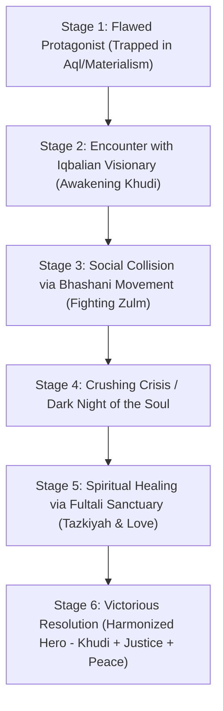

# Scholars Master Analysis & Novel Integration Engine (مفکرین کی جامع تطبیقی گائیڈ)

This comprehensive framework synthesizes the profound intellectual, social, and spiritual contributions of **Allama Muhammad Iqbal**, **Maulana Abdul Hamid Khan Bhashani**, and **Allama Abdul Latif Chowdhury Fultali** into the core engine of the `novel-ai` project.

---

## 1. Deep Tripartite Philosophical Matrix

| Domain | Allama Muhammad Iqbal | Maulana Bhashani | Saheb Qibla Fultali |
| :--- | :--- | :--- | :--- |
| **Primary Quest** | Metaphysical Self-Realization (*Khudi*) | Social Justice & Anti-Oppression | Soul Purification & Sunnah Preservation |
| **Philosophical Enemy** | Mental Slavery & Material Cynicism | Feudal Exploitation & Capitalist Greed | Moral Hardness, Hypocrisy & Ignorance |
| **Narrative Arena** | High-Rise Cities, Universities, Libraries | Villages, Peasant Marches, Prisons | Sanctuaries, Relief Camps, *Darul Qiraat* |
| **Key Metaphor** | The *Shaheen* (Eagle) & Fire | The Straw Hut & The Broken Bowl | The Soft Recitation (*Tajweed*) & Rose Attar |
| **Core Emotion** | Philosophical Fire / Passion (*Ishq*) | Holy Indignation / Moral Wrath | Serene Peace, Mercy & Tears of *Tawbah* |

---

## 2. Integrating Scholars into the 6-Stage Novel Arc

Every top Urdu novel follows a 6-stage arc. Here is how to seamlessly weave our three scholars into each stage:

### Stage 1: Flawed Protagonist (The Cold Technocrat / Cynic)
* **Internal State:** Protagonist relies purely on self-interest (*Aql*). Thinks faith is weak and money is everything.

### Stage 2: Awakening of Khudi (Iqbal Phase)
* **Event:** Protagonist meets an Iqbalian mentor who challenges their hollow success.
* **Impact:** The protagonist realizes they are living as scavengers, not as eagles (*Shaheen*).

### Stage 3: Grassroots Confrontation (Bhashani Phase)
* **Event:** Protagonist is drawn into a social struggle where feudal or corporate elites oppress innocent people.
* **Impact:** Inspired by Bhashani-style revolutionary ethics, the hero uses their skills to fight for *Rububiyyah* (divine rights of the poor).

### Stage 4: The Crisis & Lowest Point
* **Event:** The corrupt system retaliates violently. Protagonist loses wealth, status, or liberty. They face exhaustion and rage.

### Stage 5: Spiritual Sanctuary & Transformation (Fultali Phase)
* **Event:** Hero retreats to a quiet *Darul Qiraat* or sanctuary, meeting a serene guide.
* **Impact:** Learns Tajweed, *Zikr*, and *Khidmat-e-Khalq*. Their rage melts into pure, unshakeable spiritual strength.

### Stage 6: The Harmonized Resolution
* **Outcome:** The protagonist returns to the world. They possess the **intellectual eagle-wings of Iqbal**, the **fearless social justice of Bhashani**, and the **gentle inner serenity of Fultali**.

---

## 3. Emotional Whiplash & Pacing Integration

According to `Novels/AddictionMechanics.md`, great Urdu fiction relies on alternating emotional pairs. Here is how our scholar triad creates high-retention emotional whiplash:

1. **Iqbalian Tension:** High Existential Wonder ↔ Deep Self-Doubt.
2. **Bhashani Tension:** Fiery Moral Wrath ↔ Heartbreaking Vulnerability of the Poor.
3. **Fultali Tension:** Serene Divine Comfort ↔ Deep Remorse / Tears of Repentance.

---

## 4. Master Dialogue Bank across all Three Scholars

### 1. Confronting Arrogance (Iqbalian):
> *"تو نے فرعون کی تاریخ تو پڑھی ہوگی، مگر کبھی اپنے اندر کے فرعون کو بھی جھانکا ہے؟ جب تک خودی بیدار نہیں ہوتی، انسان مٹی کے بتوں کے سامنے سجدے کرتا رہتا ہے!"*

### 2. Confronting Economic Tyranny (Bhashani):
> *"خدا کے لیے روٹی چھیننے والوں کی صفوں میں کھڑے مت ہو! اس بستی کا بچہ اگر بھوکا سویا، تو تمہاری بڑی بڑی مسجدوں کے مینار تم پر گواہی دیں گے کہ تم ظالم تھے!"*

### 3. Healing a Broken Heart (Fultali):
> *"جس دل کو دنیا نے توڑ دیا ہو، اسے اللہ اپنی محبت سے جوڑتا ہے۔ سنو... جب تم قرآن پڑھتے ہو، تو رب تمہاری بات سنتا ہے۔ رو لو بیٹے، یہ آنسو تمہارے دل کی سیاہی دھو رہے ہیں۔"*
