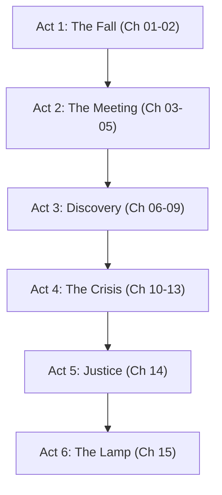

# Master Novel Blueprint: چراغِ توفیق (The Lamp of Grace - Chirag-e-Taufeeq)

---

## 1. Executive Summary & Core Pillars
**Chirag-e-Taufeeq** is a grounded, deeply moving Urdu novel designed to combine **pure romance, philosophical depth, spiritual awakening, strategic intrigue, and a deeply satisfying happy ending**.

### Core Requirements Checklist:
* **Grounded Story:** Set in modern Pakistan (Islamabad & historic Rohan Pur), focusing on architecture, heritage preservation, and public ethics.
* **Pure Love (پاک محبت):** Respectful, dignified romance built on shared values, intellectual resonance, mutual protection, and spiritual alignment.
* **Philosophy:** Iqbalian *Khudi* & *Ishq vs Aql*, Bano Qudsia's *Halal vs Haram* impact, and Bhashani's *Rububiyyah* (fighting land theft).
* **Spiritualism:** Fultali's *Tazkiyah-e-Nafs*, *Ishq-e-Rasool ﷺ*, and quiet *Sabr* leading to divine grace (*Taufeeq*).
* **Suspense & Strategy:** Deciphering ancient land deeds, legal courtroom strategy, and uncovering corporate land-grabbing syndicates.
* **Happy Ending:** Full legal vindication, complete destruction of the corrupt syndicate, and a joyful, dignified *Nikah* (marriage) resolution.

---

## 2. Character Bible & Profiles

### 1. Zoya Murtaza (Heroine - The Resilient Architect)
* **Background:** 23 years old. Raised by a single schoolteacher mother after her father's early passing. Brilliant graduate in structural architecture.
* **Personality:** Principled, observant, stubborn for truth, carries an inner pride that transforms into Iqbalian *Khudi*.
* **Character Arc:** Moves from betrayal-induced bitterness to unshakeable *Sabr* and spiritual maturity.

### 2. Taha Sikandar (Hero - The Strategic Scholar & Craftsman)
* **Background:** 27 years old. Architectural historian and master heritage restorer. Left a lucrative Dubai investment firm after refusing to engage in fraudulent practices (*Riba*).
* **Personality:** Quietly confident, protective, deeply read in Eastern philosophy, soft-spoken yet fierce against injustice.
* **Character Arc:** Embodies pure, selfless devotion—supporting Zoya's career and dignity without overshadowing her.

### 3. Hazrat Sufi Alim (Spiritual Guide - Fultali Archetype)
* **Role:** Elder of the historic Rohan Pur mosque. Teaches that *Sabr* is not passive waiting, but active moral steadfastness while waiting for God's divine grace (*Taufeeq*).

### 4. Hashim Vohra (Antagonist - Corporate Syndicate Head)
* **Role:** CEO of Vohra Constructions. Symbolizes *Rizq-e-Haram*—using sub-standard materials, bribed inspectors, and illegal land eviction.

---

## 3. The 6-Act Detailed Plot Outline (15 Chapters)

### Act 1: The Fall & The Refuge (Ch 01-02)
- **Ch 01 — The Refusal:** Zoya refuses to sign fraudulent blueprints; she is framed, blacklisted, and publicly humiliated. Her mother stands by her.
- **Ch 02 — The Blacklist:** Aftermath in Islamabad — smear campaign, financial ruin, her mother's quiet sacrifice. Zoya boards the bus to Rohan Pur, broken.

### Act 2: The Meeting of Hearts & Minds (Ch 03-05)
- **Ch 03 — Rohan Pur:** Zoya arrives in the quiet historic town. Her aunt's kindness, the first glimpse of the ancient library.
- **Ch 04 — The Library Meeting:** Zoya meets Taha — slow, formal, no instant bond. Their conversation about restoration and broken things plants a seed.
- **Ch 05 — Watching Him Work:** Zoya observes Taha's dedication. He shares his own story — quitting a Dubai job for integrity. She realizes she's not alone.

### Act 3: Strategic Discovery & Suspense (Ch 06-09)
- **Ch 06 — The Disagreement:** Zoya discovers Vohra's plan and wants war. Taha counsels patience. They clash. She storms off, then realizes he was right.
- **Ch 07 — The Waqf Document:** They discover the 300-year-old waqf deed hidden in the library's walls. First real victory.
- **Ch 08 — The Threat:** Vohra sends a warning — stone through the window, a written threat. Zoya is afraid but refuses to back down.
- **Ch 09 — The Spiritual Guide:** Hazrat Sufi Alim speaks to Zoya — she begins to understand Tazkiyah and her own Khudi.

### Act 4: The Crisis of Patience (Ch 10-13)
- **Ch 10 — The Case Takes Shape:** Long nights of work. The bond deepens through collaboration, not romance tropes.
- **Ch 11 — Vohra Strikes Back:** Vohra threatens Zoya's mother. Zoya breaks down. Taha promises to protect her family.
- **Ch 12 — The Arrest:** Taha is arrested on false charges. Zoya is alone again — her darkest moment. She prays for the first time in years.
- **Ch 13 — The Night of Tahajjud:** Zoya's spiritual breakthrough. She prays Tahajjud, finds clarity and strength. She will fight — alone if needed.

### Act 5: The Triumph of Justice (Ch 14)
- **Ch 14 — The Courtroom:** Zoya faces Vohra's lawyers alone. The judge is skeptical. Near-loss — then the recording saves her. Vohra Constructions shut down. Taha released.

### Act 6: Pure Love & The Happy Ending (Ch 15)
- **Ch 15 — The Lamp:** Taha is freed. They reunite at the library. Zoya proposes — simple, direct, dignified. Nikah at the library. The final scene: on the rooftop under the stars, their lamp will never go out.
