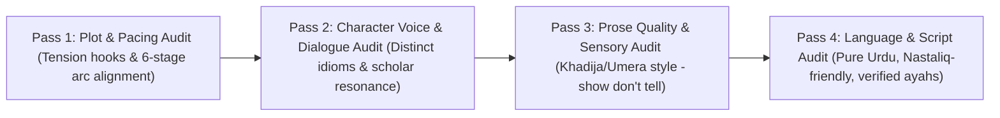

# Unified Novel Quality Audit & Writing Skill Blueprint
## Harmonizing 6 Master Novelists & 3 Islamic Philosophers into the AI Writing Engine

---

## 1. Executive Summary & Audit Purpose
This blueprint unifies the literary craft of **6 Master Urdu Novelists** with the philosophical depth of **3 Great Islamic Thinkers** to ensure that every chapter generated by the `novel-ai` engine meets the highest standards of emotional engagement, plot tension, literary Urdu prose, and moral authenticity.

---

## 2. Author Craft & Philosopher Theme Cross-Matrix

| Author / Scholar | Primary Craft Specialty | Philosophical Target | Core Metric to Check |
| :--- | :--- | :--- | :--- |
| **Umera Ahmed** | Dual POV, Epistolary, Condensed Faith Arc | **Iqbalian Khudi & Ishq** | Does every dialogue reveal inner spiritual conflict? |
| **Nimra Ahmed** | Suspense Hooks, Multi-POV Thrillers | **Iqbalian Shaheen & Modern Identity** | Is there a major mystery hook every 3 chapters? |
| **Noor Rajpoot** | High Emotional Intensity & Redemption | **Fultali Tazkiyah & Grace** | Does emotional whiplash lead to earned redemption? |
| **Sadia Rajpoot** | Psychological Realism & Social Critique | **Bhashani Rububiyyah & Justice** | Are social & class struggles grounded in human reality? |
| **Khadija Mastur** | Domestic Space Subtext & Spare Prose | **Bhashani Anti-Feudal Ethics** | Do small household details carry large political weight? |
| **Abdullah Hussain** | Epic Historical Realism & Sweeping Scope | **Iqbalian Movement & Fate** | Is historical/social context accurate and unsentimental? |
| **Allama Iqbal** | Metaphysics of Selfhood (*Khudi*) | Philosophical Foundation | Is the hero an eagle (*Shaheen*) rather than a passive victim? |
| **Maulana Bhashani** | Grassroots Social Justice (*Rububiyyah*) | Socio-Economic Foundation | Is faith manifested in fighting *Zulm* for the oppressed? |
| **Saheb Qibla Fultali** | Soul Purification (*Tazkiyah*) & Tajweed | Spiritual Foundation | Is inner peace & love of the Prophet ﷺ the ultimate cure? |

---

## 3. Mandatory 7-Point Pre-Draft Quality Rules

Every generated chapter MUST pass these 7 criteria:

1. **Pure Urdu Prose (اردو رسم الخط):** 100% Urdu script for novel text—no English mixing, no Roman Urdu. (English reserved only for code/system chat).
2. **Authentic Quranic Verses:** Never generate Quranic ayahs from memory. Always verify against verified sources or save exact verified Quranic text.
3. **The 7-Page Tension Cycle:** Include a micro-hook every 7 pages (or 1,500 words), alternating emotional pairs (e.g., Fear ↔ Hope, Wrath ↔ Divine Comfort).
4. **Chapter-Ending Hook:** Every chapter must end with one of the 7 hook types (Question Hook, Revelation Hook, Decision Cliffhanger, Threat Hook, Identity Shift, Countdown, or Emotional Peak).
5. **The Three-Scholar Harmony:**
   * **Mind:** Has Iqbalian *Khudi* been awakened?
   * **Action:** Has Bhashani's defense of *Rububiyyah* / *Mazloom* rights been addressed?
   * **Soul:** Has Fultali's gentle *Tazkiyah* / *Tajweed* harmony provided spiritual depth?
6. **Show, Don't Tell:** Convey inner pain, anger, or love through bodily gestures, dialogue hesitations, silence, and environmental metaphors (Khadija Mastur style).
7. **No Preachy Tropes:** Moral/spiritual breakthroughs must be earned through trial and character choice, never rushed or imposed like a lecture.

---

## 4. Chapter Self-Correction Protocol (4-Pass Review)

Before outputting any novel chapter, the system executes a 4-pass self-review:

---

## 5. Master Skill Checklist for AI Prompt Execution

When drafting novel content, verify that:
* Character profiles in `Novels/CharacterBible.md` align with scholar archetypes.
* Pacing templates from `Novels/AddictionMechanics.md` are active.
* Idioms from `Novels/VocabularyBank.md` match the character's social class and spiritual state.
* The chapter structure matches `Novels/SceneBuilder.md`.
